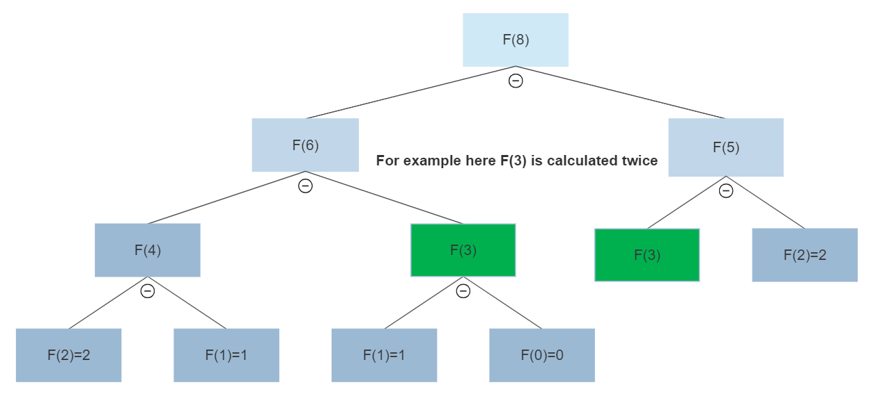

# Question No. 2 recurrence relation

This code provides four different ways to calculate the nth number of the sequence F(n) where:

F(n) = F(n-3) + F(n-2) where F(0) = 0, F(1) = 1, and F(2) = 2.

## The four ways implemented in this code are:

* Using normal recursion (function_way_1) that will take O(2^n) time complexity.
* Using bottom-up dynamic programming (function_way_2) that will take O(n) time complexity.
* Using top-down dynamic programming (function_way_3) that will take O(n) time complexity.
* Using tail recursion (function_way_4) that will take O(n) time complexity.

## Implementation details

* ###  Function_way_1

    This function uses normal recursion to calculate F(n). The time complexity of this method is O(2^n) as it requires computing the same Fibonacci numbers multiple times in order to get our solution. the next fig will show us how the solution is constracted.

* #### Advantages:

    * Simplicity: The recursive approach to calculate Fibonacci numbers is simple to understand and implement.
    * Readability: Recursive code is often easier to read and understand than iterative code.
    * No extra space needed: Recursive code doesn't need extra space for variables as it uses the stack memory.

- #### Disadvantages:

    - Exponential time complexity: The recursive approach has an exponential time complexity of O(2^n), making it very inefficient for large inputs.
    - Recursion depth limit: The maximum recursion depth is limited by the stack size, which can be exceeded for large inputs, causing a stack overflow error.
    - Redundant computation: The recursive approach may compute the same values multiple times, which can result in redundant computations and slow down the algorithm.
    - Slower than iterative approach: The recursive approach is generally slower than the iterative approach, especially for large inputs due to functions in stack memory.

* ###  Function_way_2
    This function uses bottom-up dynamic programming to calculate F(n). It initializes the values of F(0), F(1), and F(2) and then uses a for loop to calculate the value of F(n). The time complexity of this method is O(n), which is much more efficient than the previous method.
  

* #### Advantages
  - Linear time complexity: The bottom-up approach has a time complexity of O(n), making it more efficient than the recursive approach for large inputs.
  - No recursion depth limit: The bottom-up approach doesn't have a recursion depth limit, making it more suitable for large inputs.
  - No redundant computation: The bottom-up approach avoids redundant computation by storing previously computed values in an array, which is used to calculate the next value in the sequence.
  - More memory efficient: The bottom-up approach is more memory efficient than the recursive approach as it doesn't use the stack memory.
- #### Disadvantages
    - Complexity: The bottom-up approach may be more complex that recursive approach as may be less intuitive for some programmers who are used to working with recursive functions.

* ### Function_way_3
    This function uses top-down dynamic programming to calculate F(n). It uses an array to store the values of F(n) that have already been calculated. If the value of F(n) has already been calculated, it returns the stored value. Otherwise, it calculates the value using recursion and stores it in the array. The time complexity of this method is also O(n).
  

- #### Advantages
  - Linear time complexity: The top-down approach has a time complexity of O(n), making it more efficient than the recursive approach for large inputs.
  - Memoization: The top-down approach uses memoization to avoid redundant computations, which can significantly improve performance for large inputs.
  - Clarity: The top-down approach can be more intuitive for some programmers as it uses a recursive function that resembles the mathematical definition of the Fibonacci sequence.
- #### Disadvantages
    - Additional memory usage: The top-down approach uses additional memory to store the results of previously computed values, which can be a disadvantage for memory-constrained environments.
    - Recursion depth limit: The top-down approach is limited by the maximum recursion depth, which can be a disadvantage for very large inputs or in environments with limited stack space.

* ### Function_way_4
    This function uses tail recursion to calculate F(n). It is a more efficient form of recursion as it uses the same stack frame for each recursive call. The time complexity of this method is also O(n).

    - #### Advantages
        - Linear time complexity: The tail recursion approach has a time complexity of O(n) and only O(1) space complexity, making it more efficient than the recursive approach for large inputs.
        - Clarity: It is easy for every one to understand.
        - No recursion depth limit: The tail recursion approach doesn't have a recursion depth limit, making it more suitable for large inputs.
    - #### Disadvantages
        - Debugging: It is not easy to debug and trace than other approches.
        - Function call Overhead: It can be less efficient than the bottom-up dynamic programming approach for small values of n because it has more function call overhead.

## constraints 

### The constraints of the code question2.c:
  * The function will return a unsigned long long so it will calculate correctly till n = 156. 
  * The function will printThe number n must be positive and return if n < 0.
  * The function will print The number n must be less than 156 and return if n > 156.
### The constraints of the code question2bigint.c:
  * The top-down dynamic programming method which is way 3 may get into an error in n is so big as it will make stack overflew in that case.
  * The bottom-up dynamic programming method which is way 2 work perfectly with big int library and if can handel till big n input that was tested on n=1000000 and time taken wa 67s.
  * The tail recursion method which is way 4 works in a good way and as it is tail recursion it works for bigger input n than top-down approach.
  * The normal recursion method which is way 1 will not work for big input n as it will make stack overflew in that case.
  
## How to use the code
* ### To run the code question2.c:
  * First you need to compile the code using the command `gcc question2.c -o question2` then run it using `question2`.
  * Then you will be asked to enter the number n that you want to calculate F(n) for it.
  * Then the code will print the result of F(n) and the time taken to calculate it.
* ### To run the code question2bigint.c:
    * First you need to install the big int library using the commands 
      * `gcc -c big_int.c -o big_int.o`.
      * `ar rcs big_int.a big_int.o`.
    * Secondly you need to compile the code using the command `gcc -o question2bigint question2bigint.c -L. big_int.a` then run it using `question2bigint`.
    * Then you will be asked to enter the number n that you want to calculate F(n) for it.
    * Then the code will print the result of F(n).

## Big Integer Library
- To make it teoreticaly possible to calculate F(n) for big n I have implemented the big integer library which is a library that can handle big numbers and do the summation operation on them.
  - The big integer library is implemented in the file big_int.c and the header file is big_int.h.
 
    ### some functions in the big integer library:
    - ### `BigInt* create_bigint(long long num)`
    his function takes a long long integer num as input and returns a pointer to a BigInt struct that represents the same integer. It first calculates the number of digits required to represent num, allocates memory for a new BigInt, and converts the input integer into a sequence of long long integers, which are stored in the digits array of the struct. 
    - ### `void copy(BigInt* dest, BigInt* src)`
    This function copies the content of a source BigInt struct src to a destination BigInt struct dest. It allocates memory for the digits array of dest based on the size of src, and copies the digits array of src to dest.
    - ### `void add(BigInt* result, BigInt* num1, BigInt* num2)`
    This function performs the addition of two BigInt structs num1 and num2 and stores the result in a third BigInt struct result. 
  It first determines the maximum size between the two input BigInt structs, allocates memory for the digits array of result, 
  and initializes all elements to zero. 
  It then performs the addition of the two input BigInt structs digit by digit, 
  taking into account any carry that may arise during the addition. 
  The resulting BigInt is stored in the result struct, which is passed as a pointer to the function.

## Conclusion
This code provides four different methods to calculate the nth number of the sequence F(n). 
The most efficient method is the bottom up method, which has a time complexity of O(n) and does not take a lot of stack.
